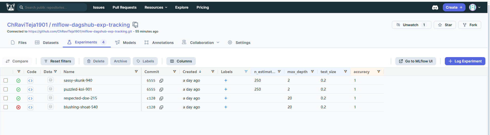
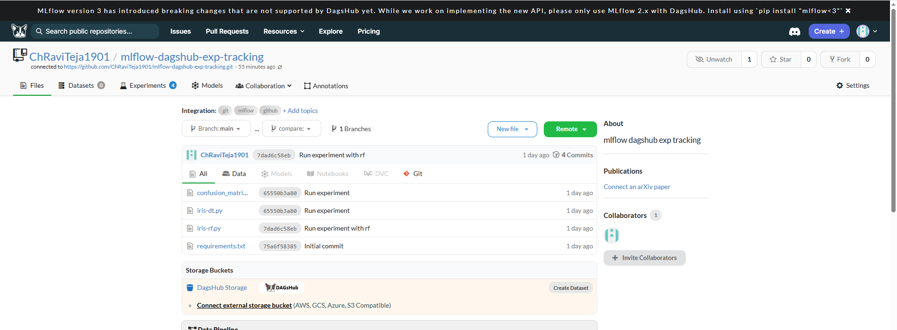
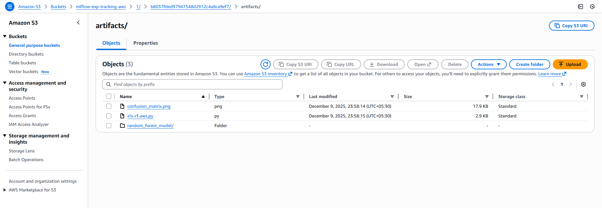
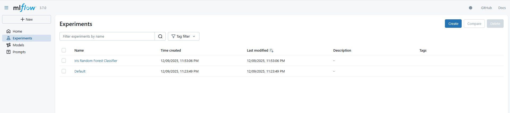

# mlflow-dagshub-exp-tracking

Small demo project showing MLflow experiment tracking with Dagshub and an optional self-hosted MLflow server on AWS (EC2 + S3).

Contents
- `iris-dt.py` — trains and logs a Decision Tree classifier on Iris.
- `iris-rf.py` — trains and logs a Random Forest classifier on Iris.
- `requirements.txt` — Python dependencies.

Quick start (Windows PowerShell)
```powershell
python -m venv .venv
.venv\Scripts\Activate.ps1
pip install -r requirements.txt
```

Run the examples
```powershell
python .\iris-dt.py
python .\iris-rf.py
```

**Dagshub (Hosted MLflow tracking)**
- **Note:** Dagshub's hosted tracking server may not support the MLflow Model Registry endpoints used by high-level APIs like `mlflow.sklearn.log_model`. If you call `log_model`, MLflow can try to create a logged model via the registry endpoint and you may see an error like:

```
mlflow.exceptions.RestException: INTERNAL_ERROR: Response: {'error': 'unsupported endpoint, please contact support@dagshub.com'}
```

- **Workaround:** save the model locally and upload the saved files as artifacts. This avoids invoking registry endpoints on the tracking server.

Example (in your training script):

```python
import mlflow
import mlflow.sklearn

# after training the `model` object
mlflow.sklearn.save_model(model, "model_local_dir")
mlflow.log_artifacts("model_local_dir", artifact_path="model")
```

This stores the model files with the run's artifacts on Dagshub without calling unsupported registry endpoints.

View experiments on Dagshub:
`https://dagshub.com/ChRaviTeja1901/mlflow-dagshub-exp-tracking.mlflow/#/experiments/0`

---

Images (Dagshub)

The following two images illustrate Dagshub's experiment listing and project overview. Place the provided screenshots in the repository at `assets/dagshub_experiments.png` and `assets/dagshub_overview.png` and they will render below.





**AWS (Self-hosted MLflow tracking on EC2 + S3)**

The following steps describe a minimal setup to run a self-hosted MLflow tracking server on an Ubuntu EC2 instance and use an S3 bucket for artifact storage. You mentioned you already created an EC2 instance, an S3 bucket, and an IAM user; these steps assume those exist.

1. System package updates & basic setup (on EC2, Ubuntu)

```bash
sudo apt update
sudo apt install -y python3-pip
sudo apt install -y pipx
sudo pipx ensurepath
```

2. Install & configure `pipenv` (recommended for isolating MLflow)

```bash
pipx install pipenv
# temporarily add pipx bin to PATH for the current session (if required)
export PATH=$PATH:/home/ubuntu/.local/bin
echo 'export PATH=$PATH:/home/ubuntu/.local/bin' >> ~/.bashrc
source ~/.bashrc
```

3. Create project folder and virtual environment

```bash
mkdir ~/mlflow
cd ~/mlflow
pipenv shell
pipenv install setuptools
pipenv install mlflow
pipenv install awscli
pipenv install boto3
```

4. Configure AWS credentials (on the EC2 instance or wherever MLflow will run)

```bash
aws configure
# Provide the IAM user's AWS_ACCESS_KEY_ID, AWS_SECRET_ACCESS_KEY, default region and output format
```

Make sure the IAM user has permissions to write to the S3 bucket (e.g., `s3:PutObject`, `s3:ListBucket`, `s3:GetObject`). Consider using a restrictive IAM policy scoped to the bucket.

5. Open EC2 security group port for MLflow UI

- In the AWS console, update the EC2 instance's security group to allow inbound TCP traffic to port `5000` from your IP (or a restricted set of IPs). This enables accessing the UI at `http://<EC2_PUBLIC_IP>:5000`.

6. Start the MLflow tracking server (run in background)

Replace `(bucketname)` below with your S3 bucket name (e.g., `mlflow-artifacts-storage`).

```bash
nohup mlflow server \\
	--host 0.0.0.0 \\
	--port 5000 \\
	--backend-store-uri sqlite:///mlflow.db \\
	--default-artifact-root s3://(bucketname) \\
	--allowed-hosts '*' \\
	--cors-allowed-origins '*' \\
	> mlflow.log 2>&1 &
```

- `--backend-store-uri sqlite:///mlflow.db` uses a local SQLite file for run metadata. For production use consider a managed database (Postgres, MySQL).
- `--default-artifact-root s3://(bucketname)` tells MLflow to store artifacts in your S3 bucket.

7. Access the MLflow UI

Open `http://<EC2_PUBLIC_IP>:5000` in your browser (replace `<EC2_PUBLIC_IP>` with your instance's public IP). You should be able to run experiments and the artifacts will be stored in the configured S3 bucket.

---

Images (AWS)

The following two images illustrate the S3 artifacts view and the MLflow UI running on the EC2 instance. Place the provided screenshots in the repository at `assets/aws_s3.png` and `assets/mlflow_ui.png` and they will render below.





Note: I added image references but did not add binary files. To display them in the README, copy your screenshots into the repository under the `assets/` directory with the filenames listed above (`assets/aws_s3.png`, `assets/mlflow_ui.png`, `assets/dagshub_experiments.png`, `assets/dagshub_overview.png`).

Security & operational notes
- Avoid using open `--allowed-hosts '*'` and CORS in production; instead restrict hosts and origin domains.
- Use an RDS/Postgres backend for durability if you expect many runs or for production setups.
- Consider TLS/HTTPS and authentication (proxying MLflow behind a webserver or using a managed solution).

If you'd like, I can:
- Update `iris-dt.py` and `iris-rf.py` to use the `mlflow.sklearn.save_model` + `mlflow.log_artifacts` pattern so they work with Dagshub.
- Add a short helper script that starts MLflow with environment-aware defaults for your EC2 setup.

---

If you want me to commit changes or update the example scripts to automatically use the artifact-logging pattern, tell me which scripts to modify and I will do it and run them locally to verify.